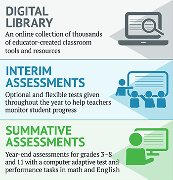

# What Is the Idaho Standards Achievement Test (ISAT)?

Idaho’s Content Standards—what we want students to know and be able to do—are designed so students graduate ready for college and a career. These tests were created specifically to gauge each student’s performance in mathematics and English language arts/literacy as he or she develops—grade by grade—the skills called for by the standards, including the ability to write clearly, think critically, and solve problems. Teachers, business leaders, and public colleges and universities all support these long-term learning goals, because they reflect what students need to be prepared for the career and college experiences that await them.

## Thousands of Students, One Common Yardstick

Every school is different, and each takes its own approach to teaching, learning, and assessing student progress. Results of any test should be considered along with other measures of learning and in consultation with a student’s teachers. Because ISAT assessments are given statewide, they provide an opportunity to measure the skills of all students against the same content standards in the same way, and the results provide information schools can use to improve teaching and learning. Given that the online tests are computer adaptive, the ISAT provides a more precise measurement of individual skills.

## A Comprehensive Assessment System

The ISAT Summative Assessments are part of a coherent and comprehensive system that also includes:

* A Digital Library for ISAT Formative Assessment which provides resources for teachers to use to help improve student learning; and
* ISAT Interim Assessments which are optional tests given during the school year to help monitor student progress.

Each of these components is designed to be used together to improve teaching and learning.

